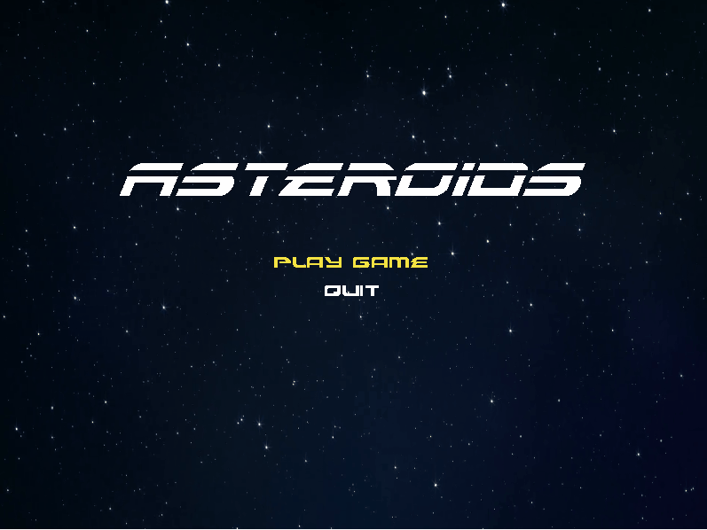
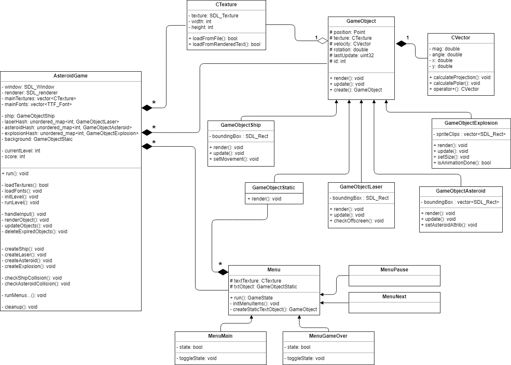

# Asteroids

Asteroids game using SDL2 library

## Dependencies
* gcc/g++ >= 5.4
* cmake >= 3.7
  * Linux: `sudo apt-get -y install cmake`
  * Mac: `brew install cmake`
  * Windows: [click here for installation instructions](https://cmake.org/install/)
* make >= 4.1 (Linux, Mac), 3.81 (Windows)
  * Linux: default installed
  * Mac: `brew install make`
  * Windows: [click here for installation instructions](http://gnuwin32.sourceforge.net/packages/make.htm)
* SDL2
  * Linux: `sudo apt-get -y install libsdl2-dev`
  * Mac: `brew install sdl2`
  * Windows: [click here for installation insturctions](https://www.libsdl.org/download-2.0.php)
* SDL2_image (loading PNG into textures)
  * Linux: `sudo apt-get -y install libsdl2-image-dev`
  * Mac: `brew install sdl2_image`
  * Windows: [click here for installation insturctions](https://www.libsdl.org/projects/SDL_image/)
* SDL2_ttf (loading fonts into textures)
  * Linux: `sudo apt-get -y install libsdl2-ttf-dev`
  * Mac: `brew install sdl2_ttf`
  * Windows: [click here for installation insturctions](https://www.libsdl.org/projects/SDL_ttf/index.html)
* SDL2_mixer (sounds)
  * Linux: `sudo apt-get -y install libsdl2-mixer-dev`
  * Mac: `brew install sdl2_mixer`
  * Windows: [click here for installation insturctions](https://www.libsdl.org/projects/SDL_mixer/)

## Build instructions

0. Enviroment: macOS
1. Clone this repo.
2. Make a build directory in the top level directory: `mkdir build && cd build`
3. Compile: `cmake .. && make`
4. Move compiled output one level up: `mv Asteroids ../ && cd ..`
5. Run it: `./Asteroids`.

## Controls

1. Use `w`, `a`, `s`, `d` to move the ship
2. Press `space` to shoot laser
3. Press `esc` for pause

## Code structure

**Figure: UML diagram**

### AsteroidGame class

Main class that contains the game loop

1. Initializes SDL assets, textures, fonts
2. Handles keyboard input
3. Manages the creation of game objects
4. Renders game objects
5. Updates game object positions
6. Checks for collisions
7. Deletes expired objects

### Game Object class

`GameObject` parent class hold position and texture of game object. Virtual functions for rendering object and updating object

**Derived classes** 

`GameObjectAsteroid`: Used for creating asteroids. Update function is overriden to update asteroid position based on velocity

`GameObjectShip`: Used for creating the ship. Update function is overriden to update ship position based on user input, direction, and velocity

`GameObjectLaser`: Used for creating lasers when the ship shoots with user input. Update function used to update position based on velocity. Object is deleted once it goes off screen

`GameObjectExplosion`: Used for creating explosions left behind from asteroids. Update function cycles though sprite animations over time until expiration

`GameObjectStatic`: Used for displaying static objects like text and background image

### Menu class

`Menu` parent class contains functionality for rendering menu items and accepting keyboard input and menu selection

**Derived classes**

`MenuMain`: Main menu at the start of the game 

`MenuPause`: Pause menu 

`MenuNext`: Menu after level completed 

`MenuGameOver`: Menu after game over (ship crashed) 

### CTexture class

Wrapper class for managing SDL Texture

### CVector class

Used for object motion. Does vector additions and calculated x/y projections
